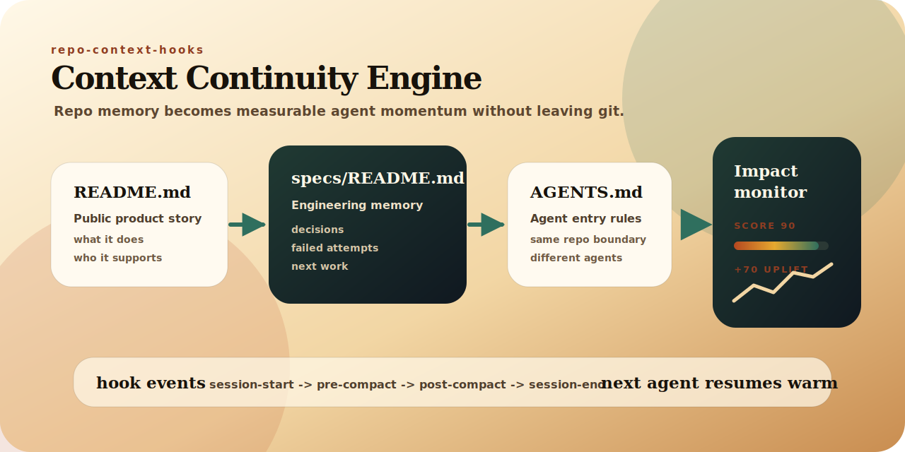
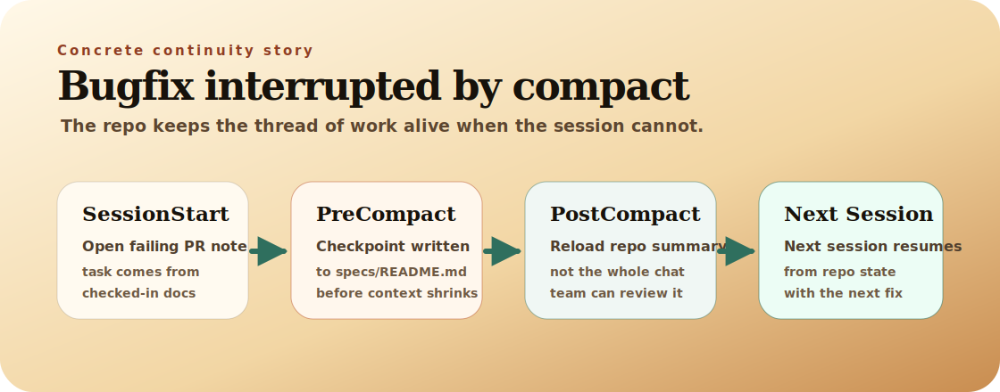
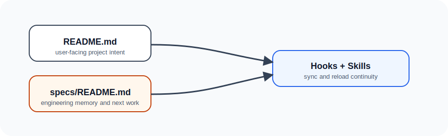
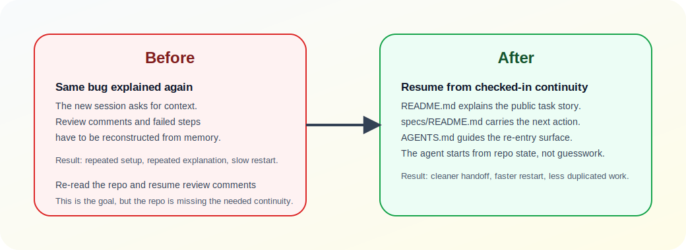

# repo-context-hooks

Repo-native continuity for coding agents.



`repo-context-hooks` keeps interrupted work, next-step context, and handoff notes in the repository instead of leaving them trapped in chat history. The goal is simple: a new session should be able to reopen the repo, understand the work in progress, and continue without rediscovering everything from scratch.

```bash
python -m pip install -e .
```

Start in any repository:

```bash
repo-context-hooks init
repo-context-hooks doctor
repo-context-hooks doctor --all-platforms
repo-context-hooks recommend
```

Current support is intentionally narrow: Claude is the native path, while Cursor, Codex, Replit, Windsurf, Lovable, OpenClaw, Ollama, and Kimi are useful but partial integrations.

The first-run path is now repo-first:

1. `repo-context-hooks init`
2. `repo-context-hooks doctor`
3. `repo-context-hooks doctor --all-platforms`
4. `repo-context-hooks recommend`
5. `repo-context-hooks install --platform <platform>`

`doctor` answers "is the repo contract healthy?" `doctor --all-platforms` answers "which supported platforms are actually ready?" `recommend` answers "what should I do next in this repo?"

## Pick Your Platform

Run one platform install command after the repo contract is healthy.

Claude:

```bash
repo-context-hooks install --platform claude
```

Cursor:

```bash
repo-context-hooks install --platform cursor
```

Codex:

```bash
repo-context-hooks install --platform codex
```

Replit:

```bash
repo-context-hooks install --platform replit
```

Windsurf:

```bash
repo-context-hooks install --platform windsurf
```

Lovable:

```bash
repo-context-hooks install --platform lovable
```

OpenClaw:

```bash
repo-context-hooks install --platform openclaw
```

Ollama:

```bash
repo-context-hooks install --platform ollama
```

Kimi:

```bash
repo-context-hooks install --platform kimi
```

## Why Repo-Native Continuity

Coding sessions rarely fail because the model forgot a fact. They fail because the useful state of the work never made it back into the repo.

When that happens, the next session has to reconstruct:

- what changed
- what was interrupted
- what tradeoffs were already decided
- what should happen next

`repo-context-hooks` narrows that problem to a repo contract teams can inspect in git. Product intent stays public in `README.md`. Engineering continuity stays in `specs/README.md`. Shared terminology stays in `UBIQUITOUS_LANGUAGE.md`. The agent workflow becomes easier to review, critique, and resume.

## How It Works

The continuity loop is repo-first:

1. start from checked-in project context
2. capture useful tactical state before an interruption or compact event
3. reload from repo state instead of relying on fragile session memory
4. leave the next session a cleaner handoff than the one you inherited

That is why onboarding now starts with `repo-context-hooks init` and `repo-context-hooks doctor`. The repo contract should exist before any platform-specific install step.

The mechanism depends on platform surfaces that vary by agent. Claude can automate more of the loop. Cursor and Codex still benefit from the same repo contract, but through narrower continuity surfaces.



## Supported Today

The public support story is intentionally narrow and explicit. These are the platforms currently supported:

- Claude (`native`): strongest support for repo hooks, session transitions, and continuity checkpoints.
- Cursor (`partial`): supports the repo contract and instruction surfaces, but not full Claude-style lifecycle parity.
- Codex (`partial`): supports repo-native continuity through checked-in repo docs and `AGENTS.md`, but not native lifecycle hooks.
- Replit (`partial`): supports repo-native continuity through `replit.md` and the repo contract, but not native lifecycle hooks or compact automation.
- Windsurf (`partial`): supports repo-native continuity through root `AGENTS.md` and `.windsurf/rules`, but not native lifecycle hooks or compact automation.
- Lovable (`partial`): supports repo-owned knowledge exports plus `AGENTS.md`, but still requires manual Project Knowledge and Workspace Knowledge steps in the Lovable UI.
- OpenClaw (`partial`): supports repo-root workspace files such as `SOUL.md`, `USER.md`, `TOOLS.md`, and `AGENTS.md`, but still requires manual OpenClaw workspace configuration.
- Ollama (`partial`): supports a repo-owned `Modelfile.repo-context` for local-model workflows, but Ollama itself is not a repo-aware agent runtime.
- Kimi (`partial`): supports root `AGENTS.md` for Kimi Code CLI project context, but not generic Kimi API setup or lifecycle hooks.

## Platform Support

The support tiers are `native`, `partial`, and `planned`.

See [docs/platforms.md](docs/platforms.md) for the support matrix, platform-specific caveats, and the current claim boundary. The short version is that we do not claim universal agent support, and we do not claim hook parity or compact automation for Cursor, Codex, Replit, Windsurf, Lovable, OpenClaw, Ollama, or Kimi.

## Readiness And Recommendations

Use the new repo-first commands together:

```bash
repo-context-hooks doctor --all-platforms
repo-context-hooks recommend
```

- `doctor --all-platforms` prints a compact readiness matrix across the current support matrix.
- `recommend` ranks the best next setup paths for the current repo, prints the repo signals it used, and gives the exact next install command to run.

That combination keeps the product honest: readiness is verification, recommendation is advice, and neither widens the public support claim.

For scripts, CI, and agent wrappers, add `--json`:

```bash
repo-context-hooks platforms --json
repo-context-hooks doctor --json
repo-context-hooks doctor --all-platforms --json
repo-context-hooks recommend --json
repo-context-hooks measure --json
```

## Prove Impact

`repo-context-hooks` now includes a local evidence loop so teams can show what continuity changed instead of only claiming it helped.

```bash
repo-context-hooks measure
repo-context-hooks measure --json
```

`measure` compares the current repo continuity score against an estimated no-continuity baseline, then reports observed hook and skill events from local JSONL telemetry. Hook scripts write small events to your OS cache by default, outside the git repo. If that cache is unavailable in a sandbox, telemetry falls back to `.repo-context-hooks/`, which `init` adds to `.gitignore`.

Use it before and after installing a platform adapter:

```bash
repo-context-hooks measure
repo-context-hooks install --platform claude
# start a new Claude session or run a compact/session-end flow
repo-context-hooks measure
```

The output is intentionally operational rather than magical: it shows repo-contract readiness, observed lifecycle events, evidence-log location, and concrete recommendations. See [docs/monitoring.md](docs/monitoring.md) for the metric definitions, privacy boundary, and before/after workflow.

Current repo snapshot:

- Score `90`
- Baseline `20`
- Uplift `+70`
- Observed hook events `26`
- Lifecycle coverage `100%`
- Monitoring view: [docs/monitoring/index.html](docs/monitoring/index.html)

Remote telemetry is not enabled in the MVP. Any future community usage metrics must be explicit opt-in and follow [docs/telemetry-policy.md](docs/telemetry-policy.md).

## Concrete Stories

The visuals in this repo are about specific interrupted-work situations, not abstract architecture theater.

### Interrupted Task Recovery

A compact event lands in the middle of a bugfix. The useful checkpoint is written back into the repo so the next session can resume with context instead of re-explaining the problem.



### Before And After Handoffs

Without a checked-in continuity contract, teams repeat themselves. With one, the next session can reopen the repo and keep moving.



## See Also

- [Platform support](docs/platforms.md)
- [Engineering memory](specs/README.md)
- [Ubiquitous language](UBIQUITOUS_LANGUAGE.md)
- [Architecture](docs/architecture.md)
- [Monitoring and impact evidence](docs/monitoring.md)
- [Telemetry policy](docs/telemetry-policy.md)
- [Competitive analysis](docs/competitive-analysis.md)
- [Minimal repo example](examples/minimal-repo/)
- [Multi-project example](examples/multi-project/)

## Development

```bash
python -m pip install -e .
python -m pytest -q --basetemp .pytest-tmp-readme-full
```

Pull requests are welcome when they make the repo contract clearer, more durable, or easier to adopt without widening the product claims beyond what the implementation supports.

## License

MIT
