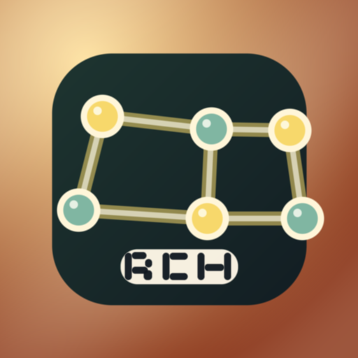

# repo-context-hooks

Agent-level continuity skill for coding agents.


<p align="center">
  
</p>


`repo-context-hooks` is an agent-level skill that keeps interrupted work, next-step context, and handoff notes alive across sessions. Install once to agent home — every workspace you open picks it up automatically.

The goal: a new agent session should start with full project context without rediscovering everything from scratch.

## Install

```bash
pip install repo-context-hooks
repo-context-hooks install --platform claude
```

That's the full install. Hooks write to `~/.claude/settings.json` and activate in every workspace from that point on.

Need per-repo hooks too?

```bash
repo-context-hooks install --platform claude --also-repo-hooks
```

## Set Up a Workspace Contract (per-repo)

```bash
repo-context-hooks init          # scaffold specs/README.md, UBIQUITOUS_LANGUAGE.md
repo-context-hooks doctor        # verify contract health
repo-context-hooks recommend     # suggest next steps
```

`doctor` answers "is this workspace contract healthy?" `recommend` answers "what should the agent do next?"

## Other Platforms

```bash
repo-context-hooks install --platform codex
repo-context-hooks install --platform cursor
repo-context-hooks install --platform replit
repo-context-hooks install --platform windsurf
repo-context-hooks install --platform lovable
repo-context-hooks install --platform openclaw
repo-context-hooks install --platform ollama
repo-context-hooks install --platform kimi
```

## Why Agent-Level, Not Repo-Level

Coding sessions rarely fail because the model forgot a fact. They fail because useful state of the work never survived the session boundary.

The old approach (install a hook per repo) means every new workspace starts from zero. The right approach is a skill installed once at agent home that activates in every workspace and uses checked-in repo files as its persistence layer.

`repo-context-hooks` brings the same model as `superpowers` and `caveman`: install once to the agent runtime, works everywhere.

- Agent skill: fires on `SessionStart`, `PreCompact`, `PostCompact`, `SessionEnd`
- Workspace contract: `specs/README.md` (engineering memory), `README.md` (product intent), `UBIQUITOUS_LANGUAGE.md` (shared terms)
- Telemetry: local JSONL events so `repo-context-hooks measure` can verify hooks actually fired

## How It Works

1. Agent skill loads at session start and reads workspace contract from repo
2. Captures tactical state into `specs/README.md` before compact or handoff
3. Reloads from repo state at next session start - not from fragile session memory
4. Leaves the next session a cleaner handoff than the one inherited


## Supported Platforms

| Platform | Support | Notes |
|----------|---------|-------|
| Claude | `native` | Full lifecycle hooks, session transitions, continuity checkpoints |
| Codex | `partial` | Repo-native continuity via `AGENTS.md`; `install_global_hooks()` writes marker to `~/.codex/settings.json` |
| Cursor | `partial` | Repo contract and instruction surfaces; no Claude-style lifecycle parity |
| Replit | `partial` | `replit.md` and repo contract; no native lifecycle hooks |
| Windsurf | `partial` | Root `AGENTS.md` and `.windsurf/rules`; no native lifecycle hooks |
| Lovable | `partial` | Repo knowledge exports plus `AGENTS.md`; requires manual UI steps |
| OpenClaw | `partial` | `SOUL.md`, `USER.md`, `TOOLS.md`, `AGENTS.md`; requires manual workspace config |
| Ollama | `partial` | `Modelfile.repo-context` for local-model workflows |
| Kimi | `partial` | Root `AGENTS.md` for Kimi Code CLI; no generic API or lifecycle hooks |

See [docs/platforms.md](docs/platforms.md) for the full support matrix.

## Readiness and Recommendations

```bash
repo-context-hooks doctor --all-platforms
repo-context-hooks recommend
```

For scripts and CI:

```bash
repo-context-hooks platforms --json
repo-context-hooks doctor --json
repo-context-hooks recommend --json
repo-context-hooks measure --json
```

## Prove Impact

```bash
repo-context-hooks measure
repo-context-hooks measure --snapshot-dir docs/monitoring
```

### Badge

Print an SVG badge of the current contract score to stdout:

```bash
repo-context-hooks measure --badge
```

Write the badge to a file (for example, to embed in your README):

```bash
repo-context-hooks measure --badge-out docs/badge.svg
```

Then embed it in your README:

```markdown

```

The badge uses shields.io flat style and is entirely self-contained - no external dependencies or network requests.

`measure` compares current repo continuity score against an estimated no-continuity baseline and reports observed hook events from local JSONL telemetry.

Current repo snapshot:

- Score `90`
- Baseline `20`
- Uplift `+70`
- Observed hook events `39`
- Unique sessions `21`
- Active days `2`
- Lifecycle coverage `25%` (session-start only so far; pre-compact and session-end fire on longer sessions)
- Monitoring view: [docs/monitoring/index.html](docs/monitoring/index.html)
- Time-series data: [docs/monitoring/history.json](docs/monitoring/history.json)

Remote telemetry is not enabled. Any future community metrics require explicit opt-in per [docs/telemetry-policy.md](docs/telemetry-policy.md).

See [TELEMETRY.md](TELEMETRY.md) for what is collected locally and how to opt out.

## Telemetry Visibility

| Surface | What it shows | How to use it |
|---------|--------------|---------------|
| [Impact monitor](docs/monitoring/index.html) | Score, uplift, lifecycle coverage, event mix | Open from GitHub or publish via GitHub Pages |
| [History JSON](docs/monitoring/history.json) | Time-series score, daily hook events, usability metrics | Import into Observable Plot, Vega-Lite, DuckDB |
| Local dashboard | Private per-repo `monitoring.html` from local event log | Run `repo-context-hooks measure` after agent sessions |
| Public snapshot | Sanitized dashboard for README or docs site | Run `repo-context-hooks measure --snapshot-dir docs/monitoring` |

## Concrete Stories

### Interrupted Task Recovery

A compact event lands in the middle of a bugfix. The useful checkpoint is written back into the repo so the next session can resume with context instead of re-explaining the problem.


### Before and After Handoffs

Without a checked-in continuity contract, teams repeat themselves. With one, the next session can reopen the repo and keep moving.


## What's New in v0.3.0

- **Agent-level install** - hooks write to `~/.claude/settings.json` once; active in every workspace automatically
- **Session metrics** - `session_id` in every telemetry record; `is_sampled()` probabilistic gate (10% default, configurable via `REPO_CONTEXT_HOOKS_SAMPLE_RATE`)
- **`auto_commit_snapshot()`** - auto-commits `docs/monitoring/history.json` on session end
- **`--also-repo-hooks` flag** - opt into per-repo hooks alongside agent-level
- **Graceful degradation** - non-git and no-contract workspaces print helpful messages and exit cleanly
- **Codex parity** - `install_global_hooks()` for Codex
- **CI/CD** - GitHub Actions with pytest matrix (Python 3.9-3.12, ubuntu + windows) and OIDC PyPI publish

See [CHANGELOG.md](CHANGELOG.md) for full history.

## See Also

- [Platform support](docs/platforms.md)
- [Engineering memory](specs/README.md)
- [Ubiquitous language](UBIQUITOUS_LANGUAGE.md)
- [Architecture](docs/architecture.md)
- [Monitoring and impact evidence](docs/monitoring.md)
- [Telemetry policy](docs/telemetry-policy.md)
- [Competitive analysis](docs/competitive-analysis.md)
- [Minimal repo example](examples/minimal-repo/)
- [Multi-project example](examples/multi-project/)
- [CHANGELOG](CHANGELOG.md)

## Development

```bash
pip install -e ".[dev]"
python -m pytest -q
```

Pull requests are welcome when they make the repo contract clearer, more durable, or easier to adopt without widening the product claims beyond what the implementation supports.

## License

MIT
