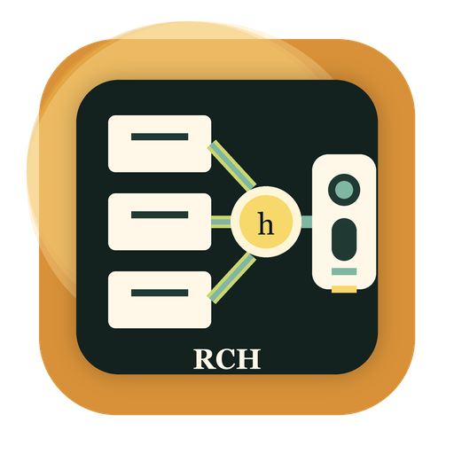
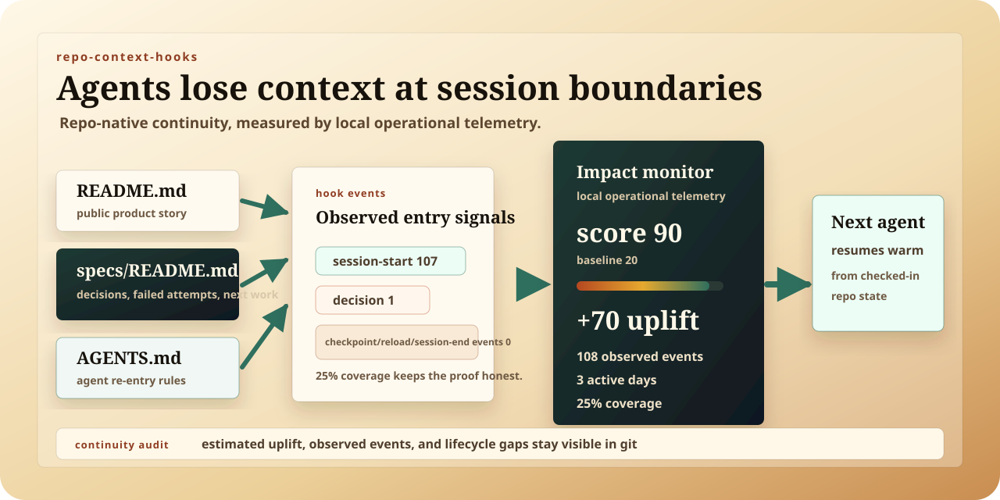
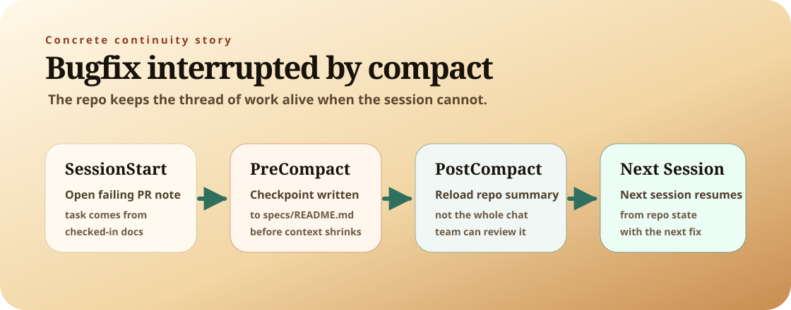
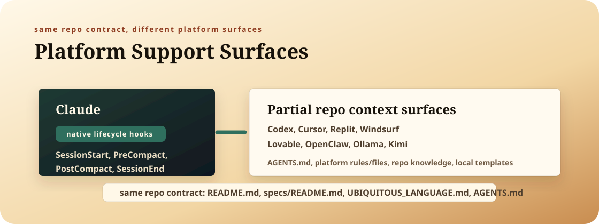
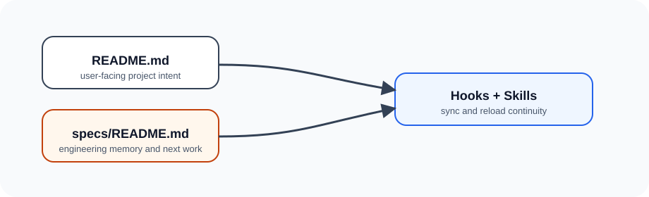
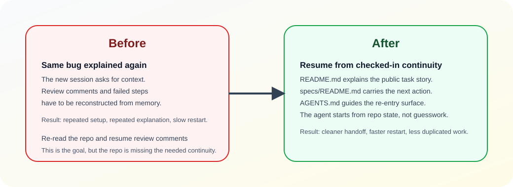

# repo-context-hooks

Agent-level continuity skill for coding agents.

<!-- BADGES:START -->
<!--
  Badge row convention. Add new badges INSIDE this anchor, one per line, in
  this order: build/quality → coverage → version/release → stability → meta.
  Each badge uses the linked form `[](click-url)`. Sibling
  Wave 2/3 PRs (#72 stability, #76 release) extend here without touching the
  surrounding markdown.
-->

[](https://codecov.io/gh/narendranathe/repo-context-hooks)
<!-- BADGES:END -->

> Coverage gate enforced at **80%** today; ratchet to 85% tracked in [#92](https://github.com/narendranathe/repo-context-hooks/issues/92).

<p align="center">
  
</p>



`repo-context-hooks` is an agent-level skill that keeps interrupted work and handoff notes alive across sessions, saving roughly 600 tokens of re-explanation and ~5 minutes of cold-start time on every resumed session, all measured locally. Install once to agent home and every workspace you open picks it up automatically.

The goal: a new agent session should start with full project context without rediscovering everything from scratch.

> **Privacy:** all telemetry is written to local JSONL files; nothing is uploaded. See [TELEMETRY.md](TELEMETRY.md).

## Install

```bash
# 1. Install the package and wire the hooks
pip install repo-context-hooks
repo-context-hooks install --platform claude

# 2. Confirm the plumbing: synthesises a hook event end-to-end and
#    prints a receipt. Exits 0 healthy, 1 broken, 2 cold-start.
repo-context-hooks verify --platform claude

# 3. Measure your continuity score on the current repo
repo-context-hooks measure --repo-root .
```

That's the full install. Hooks write to `~/.claude/settings.json` and activate in every workspace from that point on.

If `verify` exits non-zero, see the [Troubleshooting page](https://narendranathe.github.io/repo-context-hooks/troubleshooting/) — six documented failure modes with reproductions and fixes. Render a local HTML dashboard any time with `repo-context-hooks measure --open` for token, cost, and cold-start-time numbers from your evidence log.

## Impact

Every resumed session ships ~4,500 tokens of repo context (`specs/README.md`, `AGENTS.md`, `UBIQUITOUS_LANGUAGE.md`) into the agent so it doesn't re-derive state from scratch. The numbers below are estimates the tool computes from your local evidence log:

| Per resumed session | Estimate |
|---|---|
| Tokens injected | ~4,500 |
| Tokens saved (vs. cold rediscovery) | ~600 |
| Cost saved at Claude Sonnet $3/M input | ~$0.0018 |
| Cold-start time saved per `PostCompact` | ~5 min |

Run `repo-context-hooks measure` to see your own numbers. All metrics are computed locally; no data leaves your machine.

## Verify release integrity

```bash
gh attestation verify repo-context-hooks-X.Y.Z-py3-none-any.whl --repo narendranathe/repo-context-hooks
```

Need per-repo hooks too?

```bash
repo-context-hooks install --platform claude --also-repo-hooks
```

## Zero runtime dependencies

`pip install repo-context-hooks` pulls only the Python standard library at runtime - `pyproject.toml` declares `dependencies = []`. The package installs nothing into your project's import graph; hooks run inside the agent's own runtime (Claude Code, Codex, Cursor, etc.) and read checked-in workspace files. Optional development tooling (pytest, ruff, black, mypy) lives under the `[dev]` extras and is never installed for end users.

The suite is 330+ tests: unit, contract tests on the public surface, and Hypothesis property tests for sampling boundaries, `repo_id` shape, and hook dedup idempotency.

## Set Up a Workspace Contract (per-repo)

```bash
repo-context-hooks init          # scaffold specs/README.md, UBIQUITOUS_LANGUAGE.md
repo-context-hooks doctor        # verify contract health
repo-context-hooks recommend     # suggest next steps
```

`doctor` answers "is this workspace contract healthy?" `recommend` answers "what should the agent do next?"


## Write Session Decisions Back

The checkpoint command lets the agent record what was built and decided directly into `specs/README.md`. This is the semantic layer on top of the automated hook checkpoints.

```bash
repo-context-hooks checkpoint --message "Built X. Decided Y because Z. Next: W."
```

Entries are written to the `## Session Log` section of `specs/README.md` with a timestamp and branch name. The format that works best:

```
Built: JWT refresh endpoint + migration 0014. Decided: Redis over DB for refresh tokens; DB showed 3x latency under load. Reverted: DB-backed approach (latency spike). Next: wire validation into auth middleware.
```

Fields:
- **Built:** what was shipped or committed
- **Decided:** key choices and rationale
- **Reverted/failed:** dead ends so the next agent does not repeat them
- **Next:** the exact next task

The `context-handoff-hooks` skill instructs the agent to run this command at `PreCompact` and `SessionEnd` so decision history accumulates automatically across sessions.

## Other Platforms

```bash
repo-context-hooks install --platform codex
repo-context-hooks install --platform cursor
repo-context-hooks install --platform replit
repo-context-hooks install --platform windsurf
repo-context-hooks install --platform lovable
repo-context-hooks install --platform openclaw
repo-context-hooks install --platform ollama
repo-context-hooks install --platform kimi
```

## Why Agent-Level, Not Repo-Level

Coding sessions rarely fail because the model forgot a fact. They fail because useful state of the work never survived the session boundary.

The old approach (install a hook per repo) means every new workspace starts from zero. The right approach is a skill installed once at agent home that activates in every workspace and uses checked-in repo files as its persistence layer.

`repo-context-hooks` brings the same model as `superpowers` and `caveman`: install once to the agent runtime, works everywhere.

- Agent skill: fires on `SessionStart`, `PreCompact`, `PostCompact`, `SessionEnd`
- Workspace contract: `specs/README.md` (engineering memory), `README.md` (product intent), `UBIQUITOUS_LANGUAGE.md` (shared terms)
- Telemetry: local JSONL events so `repo-context-hooks measure` can verify hooks actually fired

## Scope

**Today:** repo-context-hooks runs at **single-developer scope**. Each developer
has their own local telemetry on their own machine; there is no shared team
aggregation. The hooks work the same whether you are solo or one of fifty
engineers each running them locally.

**Roadmap:** team aggregation (shared event streams, multi-seat dashboards)
is tracked in [#26](https://github.com/narendranathe/repo-context-hooks/issues/26).
If your team needs this, leave a +1 on that issue.

## How It Works

1. Agent skill loads at session start and reads workspace contract from repo
2. Captures tactical state into `specs/README.md` before compact or handoff
3. Reloads from repo state at next session start - not from fragile session memory
4. Leaves the next session a cleaner handoff than the one inherited



## Supported Platforms



| Platform | Support | Notes |
|----------|---------|-------|
| Claude | `native` | Full lifecycle hooks, session transitions, continuity checkpoints |
| Codex | `partial` | Repo-native continuity via `AGENTS.md`; `install_global_hooks()` writes marker to `~/.codex/settings.json` |
| Cursor | `partial` | Repo contract and instruction surfaces; no Claude-style lifecycle parity |
| Replit | `partial` | `replit.md` and repo contract; no native lifecycle hooks |
| Windsurf | `partial` | Root `AGENTS.md` and `.windsurf/rules`; no native lifecycle hooks |
| Lovable | `partial` | Repo knowledge exports plus `AGENTS.md`; requires manual UI steps |
| OpenClaw | `partial` | `SOUL.md`, `USER.md`, `TOOLS.md`, `AGENTS.md`; requires manual workspace config |
| Ollama | `partial` | `Modelfile.repo-context` for local-model workflows |
| Kimi | `partial` | Root `AGENTS.md` for Kimi Code CLI; no generic API or lifecycle hooks |

See [docs/platforms.md](docs/platforms.md) for the full support matrix.

## Readiness and Recommendations

```bash
repo-context-hooks doctor --all-platforms
repo-context-hooks recommend
```

For scripts and CI:

```bash
repo-context-hooks platforms --json
repo-context-hooks doctor --json
repo-context-hooks recommend --json
repo-context-hooks measure --json
```

## Prove Impact

```bash
repo-context-hooks measure                          # CLI summary
repo-context-hooks measure --open                   # rich browser dashboard
repo-context-hooks measure --snapshot-dir docs/monitoring
repo-context-hooks measure --forecast               # 30-day projection
repo-context-hooks measure --branches               # per-branch score table
repo-context-hooks measure --clean-ghosts           # prune test-run dirs (dry-run safe)
repo-context-hooks measure --badge-out docs/badge.svg
```

### Share Your Results

```bash
repo-context-hooks measure export                    # shareable markdown report (stdout)
repo-context-hooks measure export --format json      # machine-readable JSON
repo-context-hooks measure export -o report.md       # write to file
```

Paste the output directly into a LinkedIn post, pull request description, or README as adoption evidence:

```markdown
## repo-context-hooks Impact Report - my-repo

| Metric | Value |
|--------|-------|
| Contract score | 90 / 100 |
| Continuity uplift | +70 |
| Hook events recorded | 104 |
| Sessions instrumented | ~48 |
| Lifecycle coverage | 100% |
| Tokens injected | ~237,000 |

*Source: local operational telemetry - no source code, prompts, or personal data.
Generated by [repo-context-hooks](https://github.com/narendranathe/repo-context-hooks).*
```

### Run a Before/After Experiment

Capture your contract score before wiring up hooks and again after to measure the delta as concrete evidence of impact.

```bash
repo-context-hooks measure experiment start          # snapshot before score
# ... install hooks, run a few sessions ...
repo-context-hooks measure experiment finish         # compare and print the delta
repo-context-hooks measure experiment status         # check if an experiment is in progress
```

Then run `measure export` to share the results.

### Badge

The badge shows three sections: **label | score | lifecycle coverage%**. Coverage turns green at 75%+, yellow at 25-74%, red below 25%.

```bash
repo-context-hooks measure --badge-out docs/badge.svg
```

```markdown

```

### Local operational telemetry

The numbers below come from this repo's own local telemetry log (`docs/monitoring/history.json`), produced by `repo-context-hooks measure` on the maintainer's machine. Nothing leaves the machine; this is the same evidence the tool surfaces for any repo you install it in.

| Metric | Value |
|--------|-------|
| Contract score | **90 / 100** |
| Baseline without hooks | 20 / 100 |
| Continuity uplift | **+70 points** |
| Hook events recorded | 110 |
| Active days | 4 |
| Lifecycle coverage | 25% |
| Session-start events | 109 |
| Decision events | 1 |
| Checkpoint/reload/session-end events | 0 |

Shape of the data: session-start continuity is strong; compact/end coverage is not yet evidenced because `PreCompact`, `PostCompact`, and `SessionEnd` hooks have not fired during the sampling window. As compact-heavy sessions accumulate, those rows fill in and lifecycle coverage climbs above 25%.

- Monitoring view: [docs/monitoring/index.html](docs/monitoring/index.html)
- Time-series data: [docs/monitoring/history.json](docs/monitoring/history.json)

Remote telemetry is not enabled. Any future community metrics require explicit opt-in per [docs/telemetry-policy.md](docs/telemetry-policy.md).

See [TELEMETRY.md](TELEMETRY.md) for what is collected locally and how to opt out.

## Telemetry Visibility

| Surface | What it shows | How to use it |
|---------|--------------|---------------|
| [Impact monitor](docs/monitoring/index.html) | Score, uplift, tokens injected, lifecycle ring, branch health, forecast | `measure --open` or open from GitHub Pages |
| [History JSON](docs/monitoring/history.json) | Time-series score, daily events, usability metrics, branch scores, forecast | Import into Observable Plot, Vega-Lite, DuckDB |
| Local dashboard | Private full-detail view with branch + forecast panels | `repo-context-hooks measure --open` |
| Public snapshot | Sanitized version for README or docs site | `repo-context-hooks measure --snapshot-dir docs/monitoring` |

### Manage consent

Remote telemetry is disabled by default. Use these commands to inspect, preview, or change the consent state.

```bash
repo-context-hooks telemetry status              # show current consent state
repo-context-hooks telemetry preview             # preview what would be sent (nothing is sent)
repo-context-hooks telemetry enable              # opt in to remote community metrics
repo-context-hooks telemetry disable             # opt out
```

The `preview` command shows the exact payload before you decide. No data leaves your machine until you run `enable` and confirm.

## Concrete Stories

### Interrupted Task Recovery

A compact event lands in the middle of a bugfix. The useful checkpoint is written back into the repo so the next session can resume with context instead of re-explaining the problem.



### Before and After Handoffs

Without a checked-in continuity contract, teams repeat themselves. With one, the next session can reopen the repo and keep moving.



- **Session decision capture** - `repo-context-hooks checkpoint --message "..."` writes decisions, rationale, and next steps directly into `specs/README.md` Session Log; the skill now gives concrete `PreCompact` and `SessionEnd` write-back instructions instead of vague guidance
- **Session Log section** - `specs/README.md` workspace contracts now scaffold a `## Session Log` for agent-written entries, keeping it separate from the automated `## Session Checkpoints`
- **Richer automated checkpoints** - `pre-compact`/`session-end` hook checkpoints now include the last 3 git commits alongside the changed-file list

## What's New in v1.0.0

The v1.0 production-readiness release. First version with a stable public surface contract enforced in CI: every documented CLI flag, console script, environment variable, and file location is now part of the contract from this release forward. See [docs/stability.md](docs/stability.md) and [docs/deprecation-policy.md](docs/deprecation-policy.md) for what is stable vs internal.

**Closes PRD #68 (production-readiness, 10 vertical slices) and PRD #104 (cross-workspace rollup, 5 slices).**

- **`measure --all-repos`** - cross-workspace tokens-saved rollup with `--top`, `--include-ghosts`, `--redact`, and `--json` flags. Walks every workspace under your telemetry base read-only and prints fleet-level numbers; JSON output is a versioned contract (`schema_version: 1`). See [TELEMETRY.md § Fleet Rollup](TELEMETRY.md#fleet-rollup).
- **`verify` command** - synthesizes a hook event end-to-end and prints a confirmation receipt in <2 seconds. Closes the 5-30 minute trust gap between `install` and the next agent session firing. Exit 0 healthy, 1 broken, 2 cold-start.
- **`install --dry-run` and `uninstall --dry-run`** - prints the unified diff that would be applied to `~/.claude/settings.json` without writing anything. Pair with `--json` for machine-parseable output suitable for CI policy gates.
- **Troubleshooting page + auto-rendered CLI reference** - [docs/troubleshooting.md](docs/troubleshooting.md) covers six documented failure modes (hooks not firing, `events.jsonl` empty, `settings.json` clobbered, Windows path issues, multi-Python shadowing, `verify` exit 1) with reproductions and fixes. [docs/cli-reference.md](docs/cli-reference.md) is auto-rendered from `cli.py:build_parser` and gated for drift in CI.
- **Versioned docs site** - [https://narendranathe.github.io/repo-context-hooks/](https://narendranathe.github.io/repo-context-hooks/) now uses `mike` so each tagged release gets its own snapshot. The version selector dropdown is in the nav header.
- **Self-observability** - global `--debug` flag promotes stderr to DEBUG and writes full tracebacks to `<cache>/errors.log` (rotated 5 × 1 MB). `doctor` output ends with a "Last error" section so you do not have to guess where the log lives.
- **Coverage gate** - 85% threshold enforced in CI via `pyproject.toml [tool.coverage.report] fail_under = 85`. Project total now ~88%. Hypothesis property tests for `is_sampled` boundaries, `repo_id` shape, and `deduplicate_hooks` idempotency.
- **Supply-chain hardening** - PyPI Trusted Publisher (OIDC) + Sigstore signing + PEP 740 attestations. Dependabot weekly cadence for `pip` and `github-actions` ecosystems with SHA-pinned third-party Actions. CodeQL workflow active.
- **Stability contract** - explicit `__all__` in the package, machine-readable snapshot at `tests/contract/public_surface.json`, CI gate (`scripts/check_public_surface.py --verify-removals`) that fails any breaking surface change not announced through the deprecation policy.
- **Community health files** - `CONTRIBUTING.md`, `CODE_OF_CONDUCT.md`, `SECURITY.md`, `SUPPORT.md`, issue & PR templates.
- **Richer `--version`** - prints semver + short git SHA + Python version + OS + best-effort install method (`pipx`/`uv`/`pip`).

Plus everything from v0.6.0:

- **Shareable export** - `measure export` prints a redacted markdown or JSON impact report you can paste directly into a LinkedIn post, README, or PR description
- **Before/after experiment** - `measure experiment start/finish/status` captures your contract score before and after wiring up hooks so you have a real delta as evidence
- **Telemetry consent layer** - `telemetry status/preview/enable/disable` - remote telemetry stays off by default; `preview` shows the exact payload before you decide

See [CHANGELOG.md](CHANGELOG.md) for the full history.

## See Also

- [Platform support](docs/platforms.md)
- [Engineering memory](specs/README.md)
- [Ubiquitous language](UBIQUITOUS_LANGUAGE.md)
- [Architecture](docs/architecture.md)
- [Monitoring and impact evidence](docs/monitoring.md)
- [Telemetry policy](docs/telemetry-policy.md)
- [Competitive analysis](docs/competitive-analysis.md)
- [Minimal repo example](examples/minimal-repo/)
- [Multi-project example](examples/multi-project/)
- [CHANGELOG](CHANGELOG.md)

## Development

```bash
pip install -e ".[dev]"
python -m pytest -q
```

Pull requests are welcome when they make the repo contract clearer, more durable, or easier to adopt without widening the product claims beyond what the implementation supports.

## Maintainer status

This project is solo-maintained by [@narendranathe](https://github.com/narendranathe).

- **Issue response window:** best-effort within 7 days
- **PR review window:** best-effort within 14 days
- **Security reports:** handled on the [SECURITY.md](SECURITY.md) timeline (acknowledgement within 7 days, initial assessment within 14 days)
- **Active development cadence:** see [CHANGELOG.md](CHANGELOG.md)

If a thread goes quiet past these windows, please bump the issue or PR - it has not been ignored, only deprioritized against day-job load.

## Stability

`repo-context-hooks` follows [SemVer 2.0.0](https://semver.org/) starting at the `1.0.0` release. The public surface (console scripts, CLI subcommands, documented flags, `REPO_CONTEXT_HOOKS_*` env vars, and the file locations of `events.jsonl` and `settings.json` writes) will not break across a `1.x → 1.y` bump without first being deprecated for at least one full MINOR cycle.

- [Stability contract](docs/stability.md) — full list of stable vs internal surfaces
- [Deprecation policy](docs/deprecation-policy.md) — how we remove things from the surface above

The contract is enforced in CI by `scripts/check_public_surface.py`, which compares the running package against the snapshot in `tests/contract/public_surface.json`. A removal that does not follow the deprecation policy fails the build.

## License

MIT
